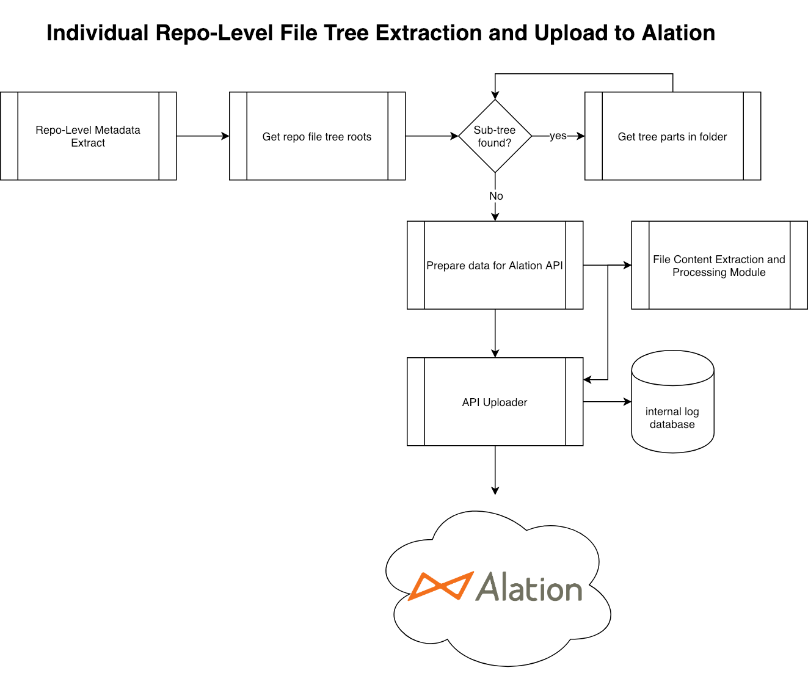

# GitHub Connector Prototype

## NOTE

This is strictly a prototype connector to extract information from jupyter notebooks and other code files. This code is absolutely not hardened enough to be a generalized connector. There are edge cases where the cataloging process may not work for notebooks which are large or have cases which I have not tested for.

Feel free to improve the code!

Extensions Covered:
- ipynb
- py
- r
- sql
- txt
- md
- c
- cpp
- xml

## Requirements
- Python 3
- The following python libraries:
    - pandas
    - tqdm
    - requests
        - `pip install pandas tqdm requests`

## High-Level Architecture Design

<div style="text-align:center"></div>

### Instructions
All `settings` are to be placed in `config.py`
1. Generate your own API token at: https://github.com/settings/tokens
    - Please be sure to give it the correct permissions. You may have to experiment to find the correct settings. If repos look empty, then grants aren't correct.
2. Copy your key into config.py as the value for `APIKEY`
3. Generate an Alation API refresh token
4. Copy your key into config.py as the value for `API_REFRESH_TOKEN`
5. Add the User ID for the owner of Alation API refresh token as the value for `API_USER_ID`
6. Add the Alation URL (without the last '/') for your instance as the value for `ALATION_HOST`
7. Create a virtual filesystem in Alation and grab it's ID. For example, if the URL for your newly created virtual filesystem is `http://ms-sandbox.alationbd.com/filesystem/1/` then the ID is `1`.
8. Add the ID as the value for `DSID`
9. if using .CER file for Alation API calls, copy the file to the same directory, set up "using_cer_file" to "Y", and provide the .cer file name in the "certificate" variable
10. Run ```python connectorProto.py```

## Limitations:

1. We currently only extract the data for master branch
2. GitHub rate limits are not being considered
